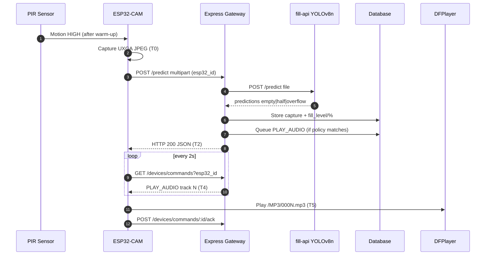

# Figure: Sequence — Motion Capture → Fill Inference → Audio

**Caption:** *Sequence diagram of PIR-triggered capture, cloud fill inference, and DFPlayer audio command delivery.*

```mermaid
sequenceDiagram
  autonumber
  participant PIR as PIR Sensor
  participant ESP as ESP32-CAM
  participant GW as Express Gateway
  participant FILL as fill-api YOLOv8n
  participant DB as Database
  participant DFP as DFPlayer

  PIR->>ESP: Motion HIGH (after warm-up)
  ESP->>ESP: Capture UXGA JPEG (T0)
  ESP->>GW: POST /predict multipart (esp32_id)
  GW->>FILL: POST /predict file
  FILL-->>GW: predictions empty|half|overflow
  GW->>DB: Store capture + fill_level/%
  GW->>DB: Queue PLAY_AUDIO (if policy matches)
  GW-->>ESP: HTTP 200 JSON (T2)
  loop every 2s
    ESP->>GW: GET /devices/commands?esp32_id
    GW-->>ESP: PLAY_AUDIO track N (T4)
  end
  ESP->>DFP: Play /MP3/000N.mp3 (T5)
  ESP->>GW: POST /devices/commands/:id/ack
```
