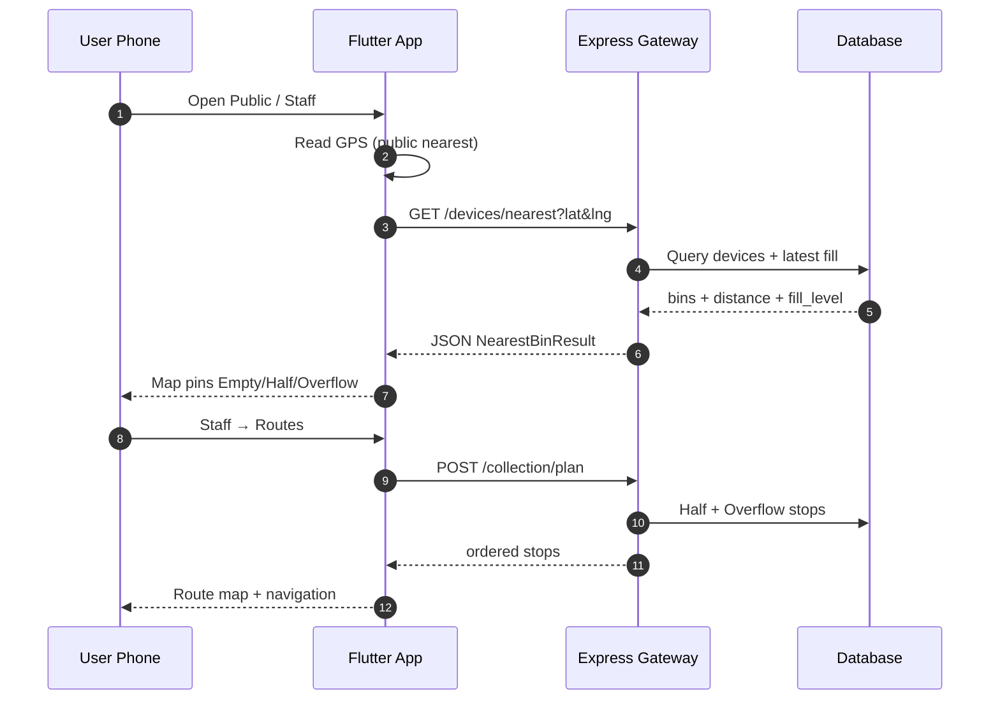

# Figure: Sequence — Flutter Consumes Fill State

**Caption:** *Citizen and staff Flutter clients reading live bin fill levels from the backend.*

```mermaid
sequenceDiagram
  autonumber
  participant User as User Phone
  participant App as Flutter App
  participant GW as Express Gateway
  participant DB as Database

  User->>App: Open Public / Staff
  App->>App: Read GPS (public nearest)
  App->>GW: GET /devices/nearest?lat&lng
  GW->>DB: Query devices + latest fill
  DB-->>GW: bins + distance + fill_level
  GW-->>App: JSON NearestBinResult
  App-->>User: Map pins Empty/Half/Overflow

  User->>App: Staff → Routes
  App->>GW: POST /collection/plan
  GW->>DB: Half + Overflow stops
  GW-->>App: ordered stops
  App-->>User: Route map + navigation
```
